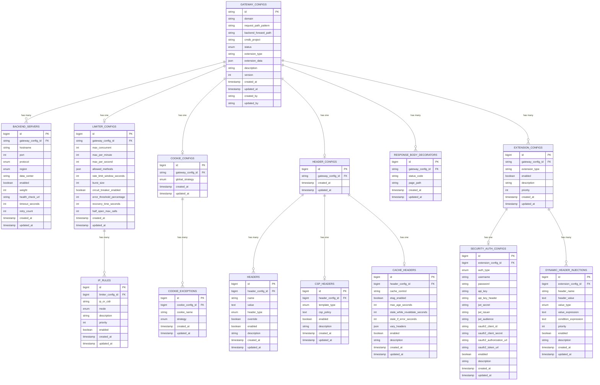
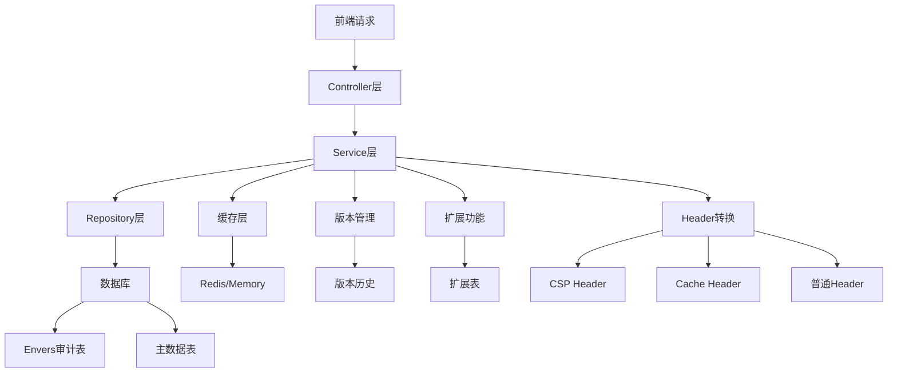

# Gateway Admin 数据库实体关系图

## ERD 图

## 表关系说明

### 1. 核心关系
- **GATEWAY_CONFIGS** 是主表，包含所有网关配置的基本信息
- 每个网关配置可以有多个后端服务器（一对多）
- 每个网关配置有且仅有一个限流配置、Cookie配置、Header配置（一对一）
- 每个网关配置可以有多个响应体装饰器和扩展配置（一对多）

### 2. Header系统整合
- **HEADER_CONFIGS** 作为Header配置的主表
- **HEADERS** 存储普通的请求和响应Header
- **CSP_HEADERS** 存储内容安全策略配置，作为特殊的响应Header
- **CACHE_HEADERS** 存储缓存策略配置，作为特殊的响应Header

### 3. 扩展配置系统
- **EXTENSION_CONFIGS** 支持多种扩展类型
- **SECURITY_AUTH_CONFIGS** 安全认证配置（一对一）
- **DYNAMIC_HEADER_INJECTIONS** 动态Header注入配置（一对多）

### 4. 子表关系
- **LIMITER_CONFIGS** 可以有多个 **IP_RULES**（一对多）
- **COOKIE_CONFIGS** 可以有多个 **COOKIE_EXCEPTIONS**（一对多）
- **HEADER_CONFIGS** 可以有多个 **HEADERS**（一对多）

## 数据流图

## 索引策略

### 主键索引
- 所有表都有主键索引
- 使用B-tree索引提高查询性能

### 外键索引
- 所有外键字段都创建索引
- 提高JOIN查询性能

### 业务索引
- `gateway_configs.domain + request_path_pattern` 唯一索引
- `gateway_configs.status` 状态索引
- `gateway_configs.extension_type` 扩展类型索引
- `backend_servers.hostname` 主机名索引
- `ip_rules.ip_or_cidr` IP地址索引
- `headers.name` Header名称索引
- `extension_configs.extension_type` 扩展类型索引

## 数据完整性

### 外键约束
- 所有关联表都有外键约束
- 级联删除配置
- 防止数据不一致

### 唯一性约束
- 域名和路径组合唯一
- 一对一关系表的外键唯一

### 检查约束
- 枚举字段值检查
- 数值字段范围检查
- 字符串字段长度检查

## 性能优化

### 查询优化
- 使用合适的索引
- 避免全表扫描
- 优化JOIN查询

### 缓存策略
- 二级缓存配置
- 查询缓存使用
- 缓存失效策略

### 分页查询
- 使用LIMIT和OFFSET
- 避免深度分页问题
- 优化COUNT查询 